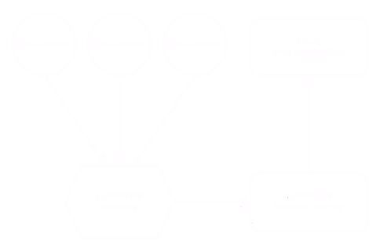

# Parking Lot Monitor

This project is a **proof-of-concept** system for real-time monitoring of parking space
availability, designed to be low-cost, low-maintenance, and scalable. It leverages custom-built
IoT sensors and a lightweight data processing pipeline to periodically report parking occupancy.
Although built for *limited deployment*, this system's architecture allows for expansion to
monitor additional spaces and incorporate new features as needed.

# Table of Contents

- [Setup and Deployment](#setup-and-deployment)
- [Project Architecture](#project-architecture)
    - [LoRaWAN End-Devices](#lorawan-end-devices)
    - [LoRaWAN Gateway](#lorawan-gateway)
    - [LoRaWAN Network Server](#lorawan-network-server)
    - [Web Application](#web-application)

# Setup and Deployment

View each of the following modules for specific details on deployment on those sections.

- [LoRaWAN End-Devices](./devices/README.md)
- [LoRaWAN Gateway](./gateway/README.md)
- [LoRaWAN Network Server](./server/README.md)
- [Web Application](./website/README.md)

# Project Architecture

## LoRaWAN End-Devices

Each parking space being monitored will be fitted with an **end-device** that includes a
**time-of-flight sensor** and **magnetic-field sensor** for event monitoring. These sensors are
connected to an **ESP32 microcontroller**, which handles the frequency of pings and transmits
data through a modulation technique called **Chirp Spread Spectrum (CSS)**.

## LoRaWAN Gateway

The **LoRaWAN gateway** is setup to monitor for broadcasted signals in the specified region
*(915 Hz for the United States)*. These signals are sent by LoRaWAN devices using a non-IP
protocol, which means they cannot be directly processed or transmitted over standard IP networks.
As a result, the gateway is required to forward these signals to a network server, where they can
be stored and further processed.

## LoRaWAN Network Server

The **LoRaWAN network server** is responsible for decoding the data sent by the **end-devices**
and processing it accordingly. It serves as the central hub for managing the entire LoRaWAN
network, where configurations for gateways, devices, and rules for handling incoming data are
defined. This includes tasks such as validating device data, ensuring security, and routing the
data to the appropriate application servers for further use.

## Web Application

The **web application** serves as a forward-facing platform that allows users to view data
collected and processed by the LoRaWAN network. It displays real-time and historical sensor
data in an easy-to-understand format, providing insights into the information gathered by
end-devices.

# Attribution

- https://github.com/chirpstack
- https://github.com/TheThingsNetwork
