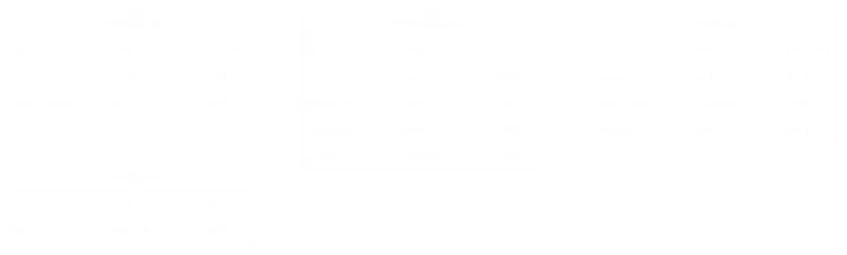

# Parking Lot Monitor System

This project is a **proof-of-concept** system for real-time monitoring of parking space availability, designed to be low-cost, low-maintenance, and scalable. It leverages custom-built IoT sensors and a lightweight data processing pipeline to periodically report parking occupancy. Although built for *limited deployment*, this system's architecture allows for expansion to monitor additional spaces and incorporate new features as needed.

# Table of Contents

- [Setup and Deployment](#setup-and-deployment)
- [System Architecture](#system-architecture)
    - [End Device](#end-device)
    - [Network Server](#network-server)
        - [LoRaWAN Gateway]()
        - [MQTT Broker]()
    - [Application Server](#application-server)
        - [ExpressJS Server](#expressjs-server)
        - [PostgreSQL Database](#postresql-database)
        - *[TBD: Backup Service]()*
    - *[TBD: Reverse Proxy]()*
- [Considerations](#considerations)
    - [LoRaWAN](#lorawan)
    - [Database](#database)
    - [MQTT](#mqtt)

# Setup and Deployment

Run the docker deployment.

```bash
docker network create plms-network
docker volume create postgresql-data
docker volume create mosquitto-data

docker compose up -d
```

Populate the database with test data.

```bash
cd ./db
pip install -r requirements.txt
python populate_test_data.py --host <HOST> --port <PORT> --user <USER> --dbname <DBNAME>
```

# System Architecture


## End-Device

Each parking space is fitted with a device that includes a **time-of-flight sensor** and **magnetic-field sensor**. These sensors are connected to an **ESP32 microcontroller**, which processes the data received and transmits it to the **LoRaWAN network** via a **LoRa Transmitter** and *915 Hz*.

## Network Server

A **LoRa gateway** will monitor for broadcasted signals at *915 Hz*, ensuring data from the end-devices are properly formatted and securely transmitted to the **application server** for storage and further processing. An **MQTT broker** is also used to facillitate the transfer of data packets, allowing for a reliable and secure means of communication.

### LoRaWAN Gateway

### MQTT Broker

## Application Server

*TODO*

### ExpressJS Server

### PostreSQL Database



# Considerations

## LoRaWAN

- **Data Rate:** LoRaWAN supports data rates ranging from approximately 0.3 kbps to 50 kbps.
- **Latency:** LoRaWAN is optimized for lower-power, infrequent data transmission. Latency can be expected on the order of seconds, potentially up to several minutes.
- [Chirpstack Docker Compose](https://github.com/chirpstack/chirpstack-docker/)

## Database

- **Connection Pooling:** Database connection pooling can allow for more efficient queries by reusing a fixed number of active connections rather than opening and closing one each time a request is made.
- **Caching:** Database caching can be valuable, especially at scale. Storing frequently accessed data can reduce the load on the database and improve response time.
- **Indexing**: Database indexing can speed up queries for common fields.

## MQTT

- **Security:** MQTT communications can be made secure with TLS, providing confidentiality and information integrity.