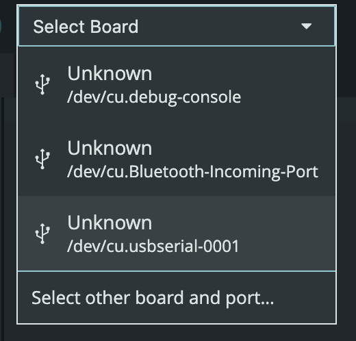
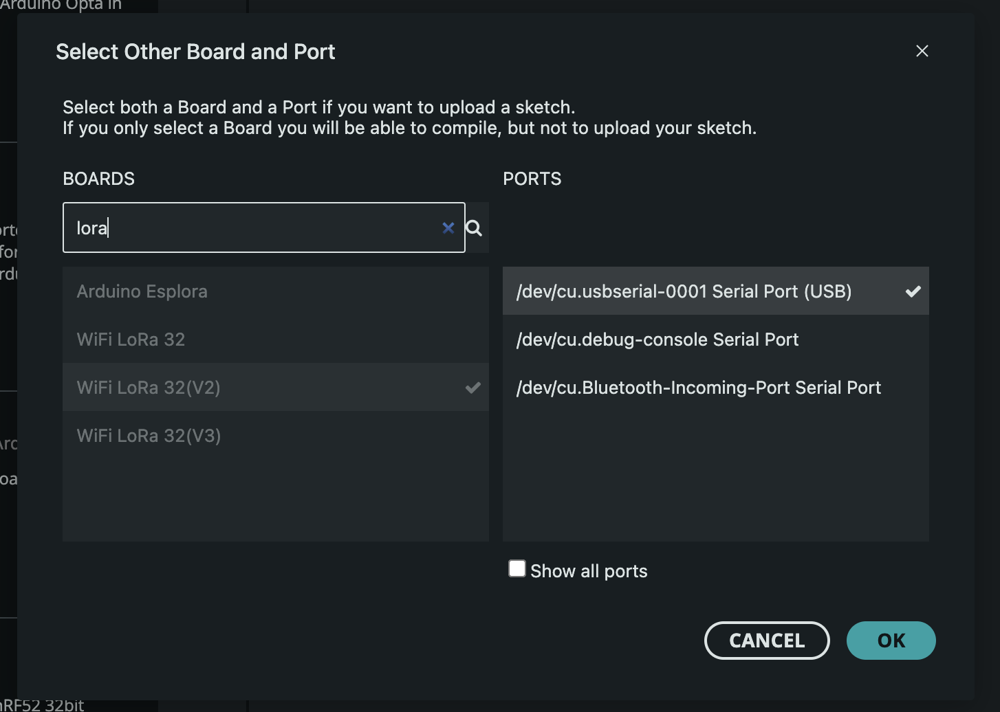
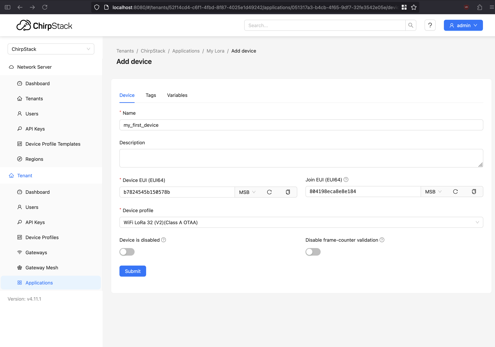
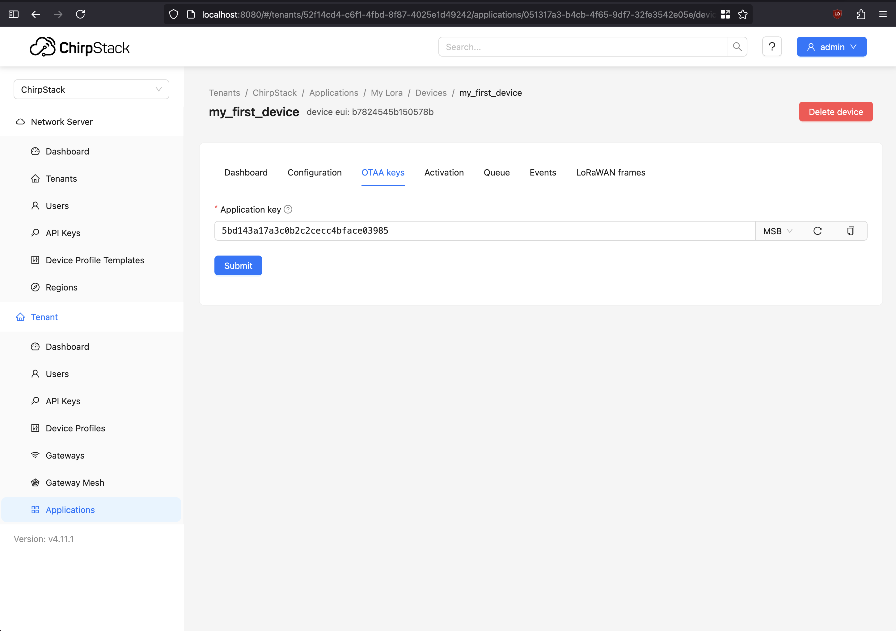
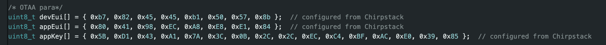
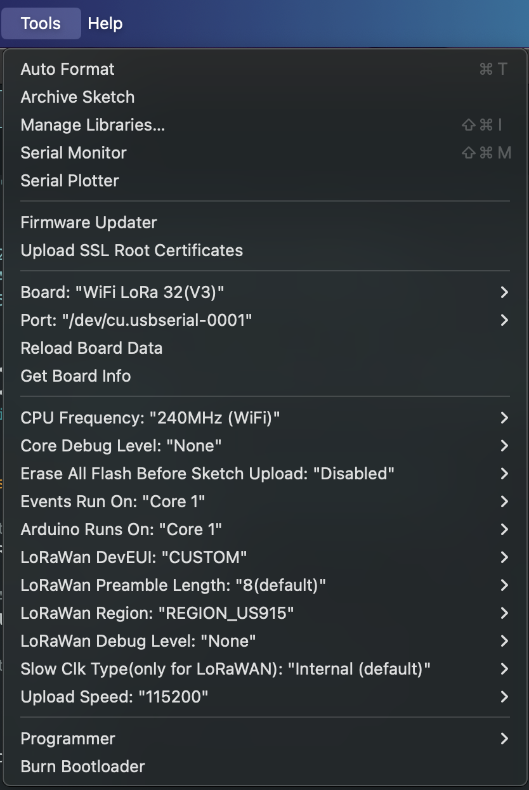
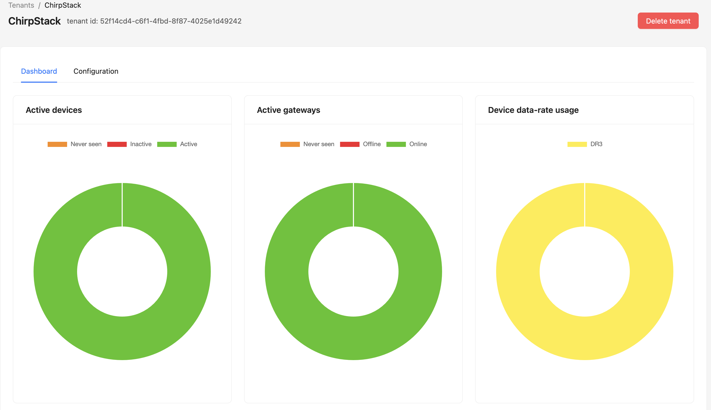

# UP Parking Monitor - Device Module

This module contains the setup for the **LoRaWAN End-Devices**.

# Prerequisites

This guide is a very brief overview of the documentation provided by [Heltec](https://docs.heltec.org/en/node/esp32/esp32_general_docs/quick_start.html).
For more information and troubleshooting details, view the official product datasheets.

## IDE

Ensure you have a proper IDE capable of interacting with the arduino devices. A notable choice is [Arduino IDE]().

Once downloaded, open the preferences pane and paste the following to **Additional boards manager URLs:** `https://resource.heltec.cn/download/package_heltec_esp32_index.json`. This will download the required libraries used to add functionality to Heltec LoRa devices.

Next, download the following libraries:
    - [Adafruit_BusIO](https://github.com/adafruit/Adafruit_BusIO)
    - [Adafruit_GFX_Library](https://github.com/adafruit/Adafruit-GFX-Library)
    - [Heltec_ESP32_Dev-Boards](https://github.com/HelTecAutomation/Heltec_ESP32)

## Device

Connect the desired device to the computer. Then select the device through the Arduino IDE. If this is the first time
connecting this device, you might need to speicfy the board and port. here, we can use `WiFi LoRa 32(V2)`.

# Setup

Copy and paste the starter code into the `ino` file. There are a few parameters that will need
configuring before compiling and uploading to the device.

## Activation

All of these are required for [Over-the-Air Activation](https://www.thethingsindustries.com/docs/hardware/devices/concepts/abp-vs-otaa/).
    - `devEUI`
    - `appEUI`
    - `appKey`

In reality, these values can be random `uint8`. However, it is better to use ChirpStack to generate
these values to ensure secure values and avoid duplication.

Navigate to ChirpStack's **Applications** page and select the application previously created when initially setting up the network server.
Then select add new device. Give it a meaningful name and description (again can be anything), then click on the arrow next to
`Device EUI` and `Join EUI`, which will generate random values for the device being progorammined. COPY THESE DOWN. Then select the correct profile for the
device (again setup in the network server steps).

You will then be directed to the **OTAA Keys** page. Once again, press the arrow to generate a random value, then submit. again, COPY THESE DOWN.

Finally, fill in the parameters with those newly generated values.

There are also some environment variables that need configuring. Mainly, `LoRaWAN DevEUI` should be se to `CUSTOM`, `LoRaWAN Region` should be set to `US_915`.

Now compile and upload the code to the device and it should start sending data to the LoRaWAN gateway. If there are some issues, ensure the firewall where
ChirpStack is being run on allows ports `1883` to be exposed.

