# UP Parking Monitor - Network Module

This module contains the setup for the **LoRaWAN Network Server**, the critical portion of the
system that bridges the connection between hardware and software.

# Installation

The simplest installation method would be through [Docker]().

```bash
# run this to start the chirpstack server & associated services
docker compose up
```

```bash
# run this to do these tasks in the background
docker compose up -d
```

You can view the logs and status of the ChripStack server by running:

```bash
docker compose logs -f
```

If everything has been setup correctly, you should be able to access the ChirpStack server on
`http://localhost:8080`, or whichever port is specified in the `compose.yaml` file.

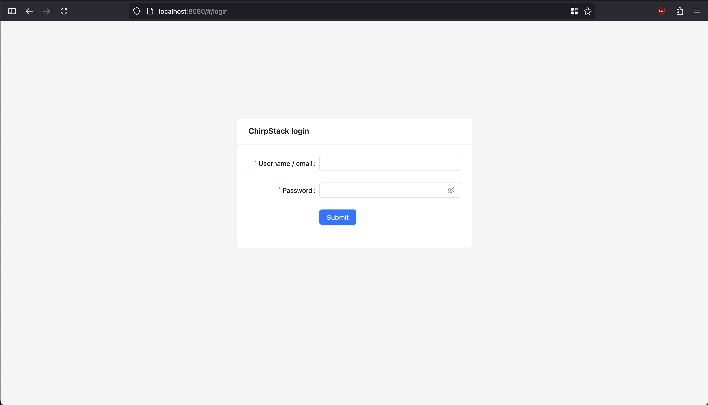

From here, you can use the username `admin` and password `admin` to login.

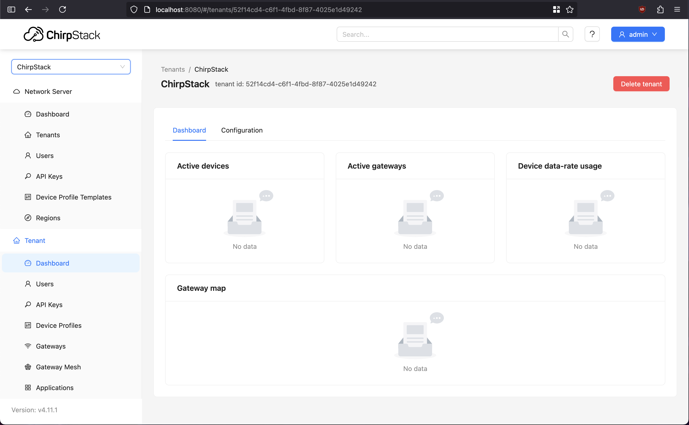

Finally, in order for ChirpStack to connect with and interact with LoRa devices properly, it must
have its profile saved. This can be done manually by navigating to the **Device Profile Templates**
page and adding all of the details. However, the simpler method is by cloning the repository
with these profiles preconfigured and installing them directly into the Docker volume.

```bash
make import-lorawan-device-profiles
```

Once you install the profiles, you can refresh the **Device Profile Templates** page and should see
a populated list.

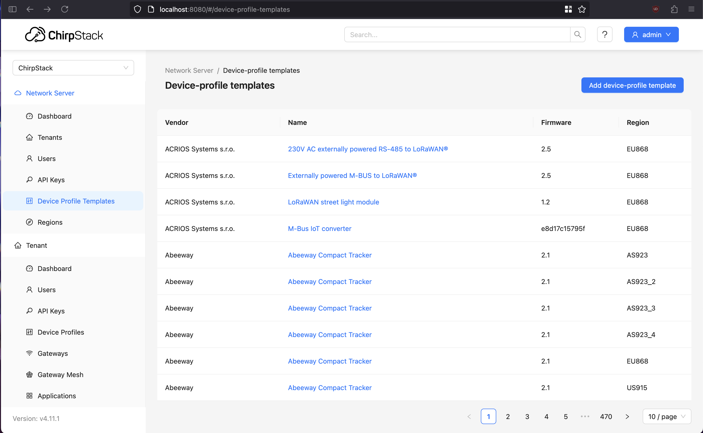

# Setup

## Gateway

First, connect to the gateway's WiFi network. This guide with use the `WisGate Edge Lite 2`, which
should have an SSID of the form `RAK7268_XXXX`. Once connected, you should be able to access the
gateway's configuration through a web portal located at `http://192.168.230.1`. You can login with the username `root` and the password located in the team's folder.

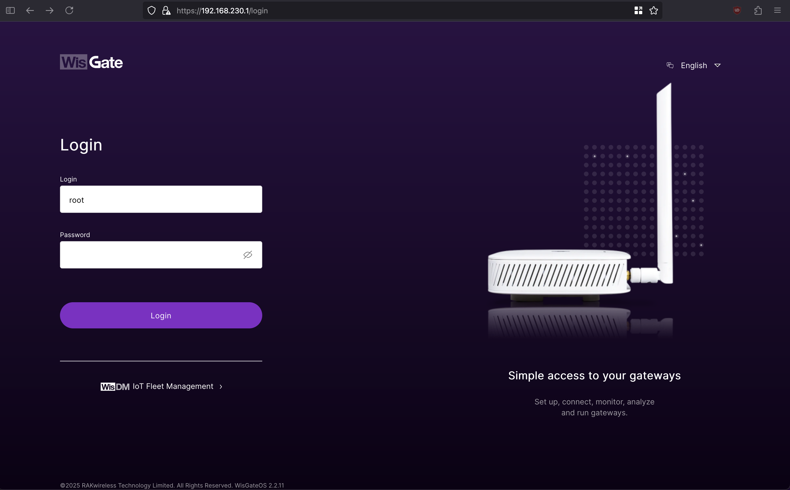

Navigate to the **Configuration** page. Since this gateway is not the primary network server used
to manage our collection of LoRa devices, we will not be using the built-in network server. Instead,
switch the **Work Mode** to `Packet Forwarder`, as we will want to send any received data packets to
our ChirpStack server we setup in the previous step.

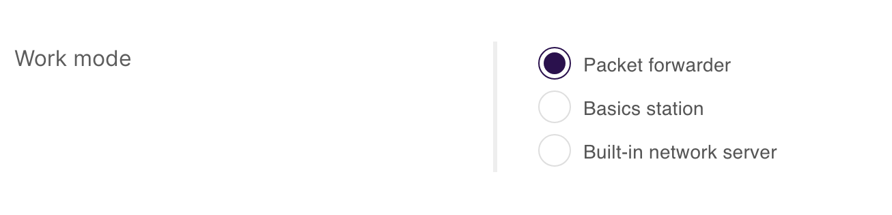

Next is the **Frequency Plan**. Select the correct country and region, in our case, `United States of America` and `US915`. You can leave the two switches below checked on. For the **Frequency Sub-Band**,
this option must match the configuration set on the [Devices](). Otherwise, the gateway will miss or
record false positive CSS signals.

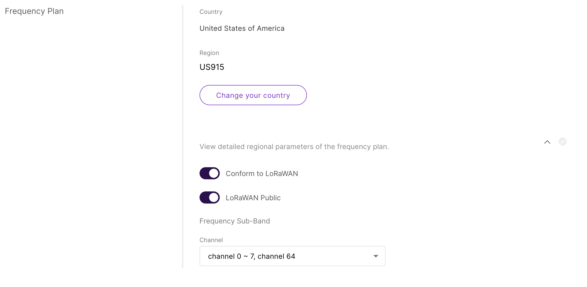

For **Protocol**, we can use an **MQTT Bridge** to pass along any received data packets as that is
built natively into ChirpStack. The default statistic interval of 30s will suffice. For the specific
MQTT protocol, ensure `MQTT for ChirpStack 4.x (Protobuf)` is selected. Aside from the
**MQTT Broker Address**, the remaining parameters can be left as default.

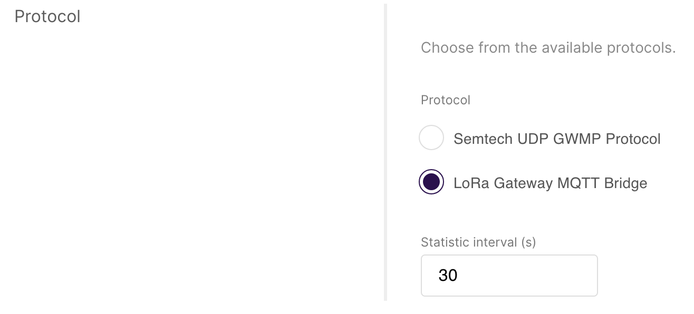

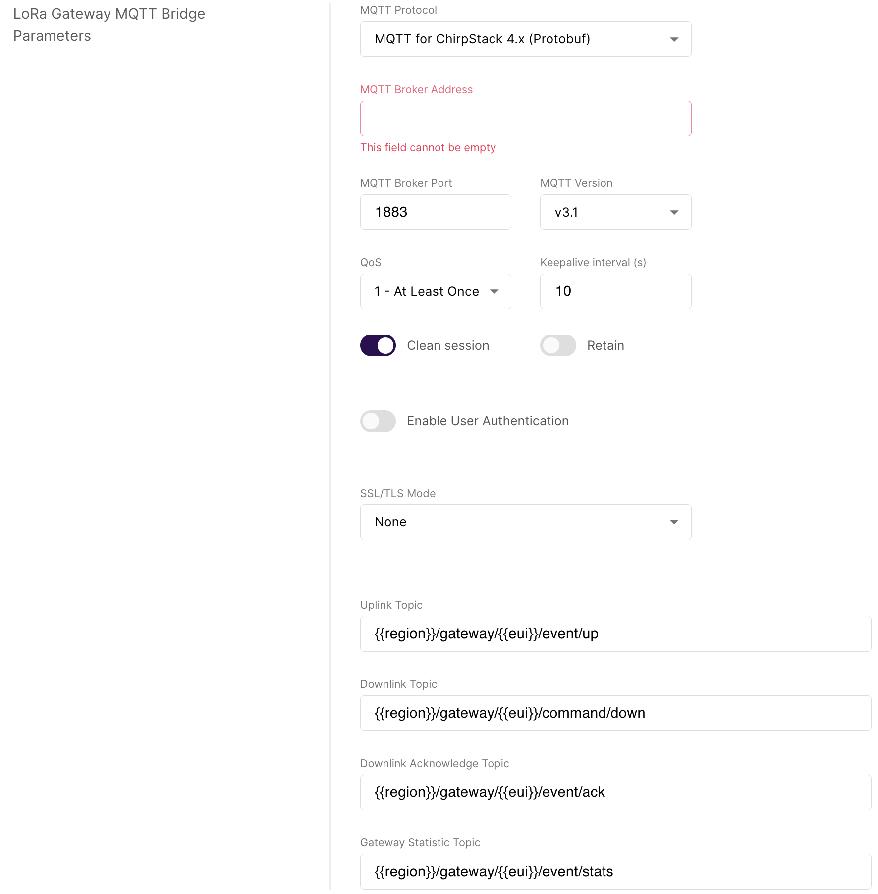

For the **MQTT Broker Address**, you need to find the IP of the server you are running the ChirpStack server on. Since
the server is currently running on our localhost for development, you can see what your device's host address on the
gateway's LAN is by running the following:

```bash
ifconfig
```

then search for the block of `en0`. It should look like the following:

```
en0: flags=8863<UP,BROADCAST,SMART,RUNNING,SIMPLEX,MULTICAST> mtu 1500
        options=6460<TSO4,TSO6,CHANNEL_IO,PARTIAL_CSUM,ZEROINVERT_CSUM>
        ether a2:fc:a7:51:3f:71
        inet6 fe80::411:a3c2:53a6:e15b%en0 prefixlen 64 secured scopeid 0xe
        inet6 fd53:4d33:88e9:10:1ca3:2a86:461d:d377 prefixlen 64 autoconf secured
        inet 192.168.230.132 netmask 0xffffff00 broadcast 192.168.230.255
        nd6 options=201<PERFORMNUD,DAD>
        media: autoselect
        status: active
```

The IP address directly following `inet` is what we are looking for, in this case it is `192.168.230.132`.
This is what should be added in the **MQTT Broker Address**.

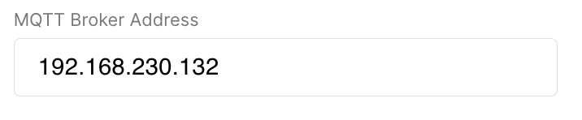

Finally, you can save you changes. The remaining configuration parameters can be updated but are not mission critical.

Before closing the tab, navigate to the **Overview** page and copy down the `EUI`. This will be used when connecting
the gateway to ChirpStack.

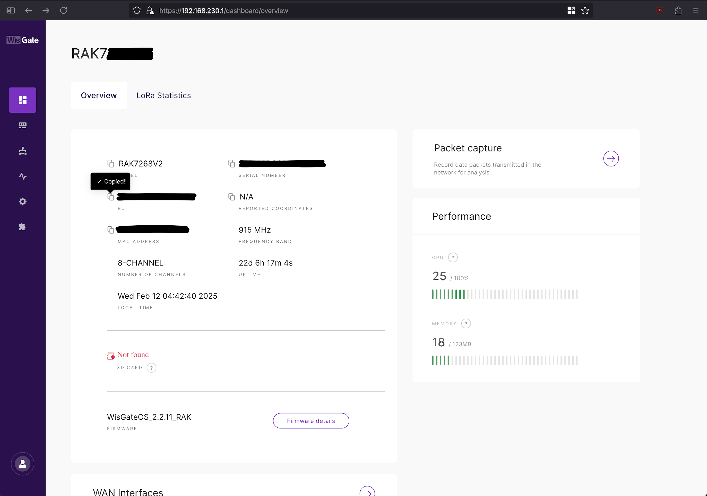

## ChirpStack

Now that the ChirpStack server is up and running, we need to make sure it is open and ready to
accept connections from LoRa devices, specifically **our** LoRa devices.

Navigate to the **Device Profiles** page under the **Tenant** category. Press the
**Add Device Profile** button and select the appropriate device. The specific profile used for
this project was the `Heltec Automation, WiFi LoRa 32 (V2) (Class A OTAA), US915`.

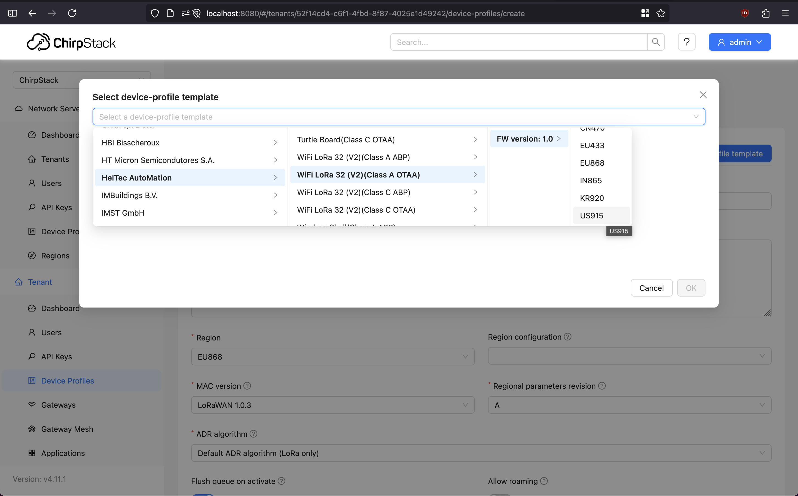

Since we already imported the device profiles from an actively maintained database, we can just
confirm the settings.

Next, navigate to the **Gateways** page and add new. Give a custom name and description for the gateway,
these fields do not matter in the configuration step. Stats interval should match that which was set in
the gateway step for the MQTT broker. Finally, add the previously copied `EUI` as the `Gateway ID` and
ensure `MSB` or *most significant bit* is selected. Then submit.

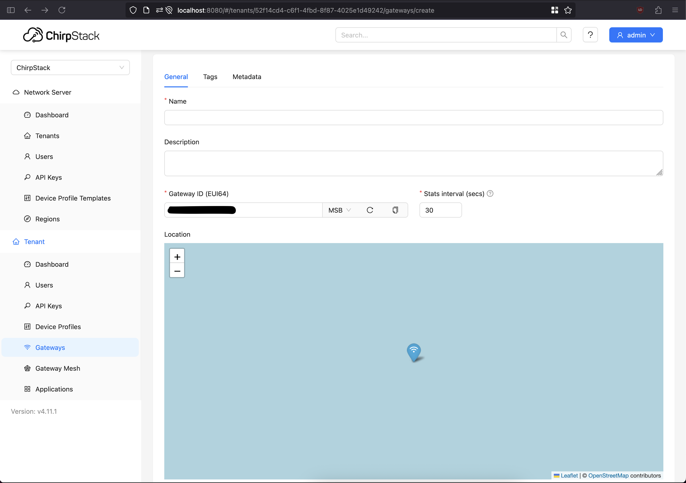